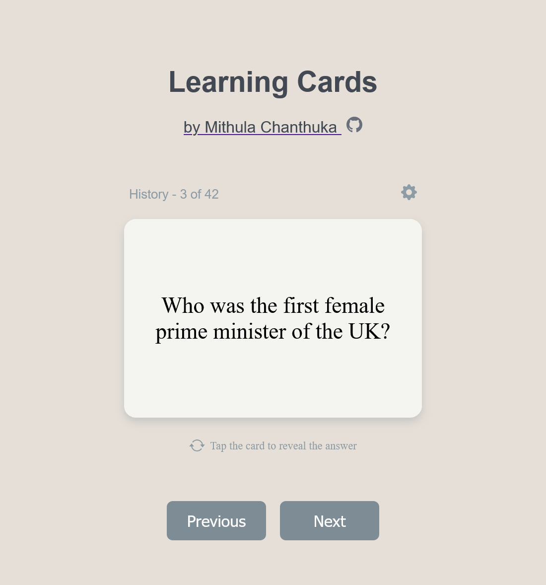

# 📚 LearningCards

A simple, lightweight website built with **HTML, CSS, and JavaScript** that lets users take turns practicing with flashcards.  
Choose from preset subjects or create your own custom sets!  
Perfect for quick study sessions, group practice, or building your own learning topics.

## 🎥 Project Demo

## 📸 Demo Preview

## 🚀 Features

- 🔁 Turn-based flashcard practice
- 📚 Preset and customizable flashcard sets
- 🎯 Simple, responsive UI for focused study
- 🧠 Great for solo learning or small groups

## 🛠️ Built With

- HTML5
- CSS3
- JavaScript (Vanilla)

---

Feel free to clone, fork, or contribute!
